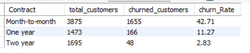
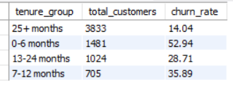
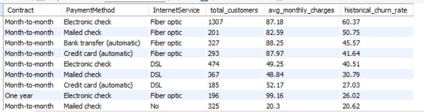
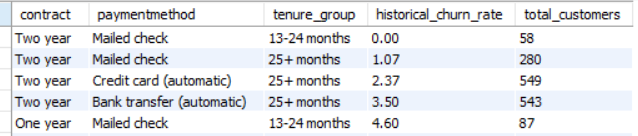
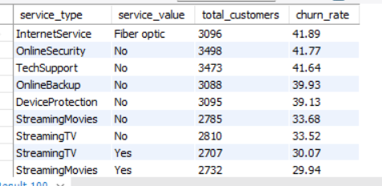

# Telecom-Customer-Churn-Analysis

**Project Overview**

This project analyzes the Telco Customer Churn dataset to understand why customers leave and identify key factors driving churn. The main goal is to find high-risk customer segments, discover safe/loyal segments, and provide actionable insights to improve customer retention.
Through exploratory data analysis and SQL queries, the project highlights important patterns related to contract types, tenure, payment methods, and additional services.

**Dataset Description**

The dataset contains information about 7,043 customers of a telecom company. It includes customer demographics, account information, services subscribed, billing details, and a target column Churn indicating whether the customer left the company (Yes/No).

**Key columns include:**

Contract type, Tenure, Monthly Charges, Total Charges
Payment Method, Internet Service
Additional services (OnlineSecurity, TechSupport, StreamingTV, etc.)

**Tools Used:**

**MySQL** – For data analysis and writing SQL queries
**Python (Jupyter Notebook)** – For data cleaning and exploration
**Power BI **– For creating interactive dashboards and visualizations

**Insights:**

**1. High Churn in Month-to-Month Contracts**

- Churn rate is high in month-to month contract type i.e 42.71% which is high than any other contract type that clearly shows that customers who are using our service based on month to month contract are more likely to churn.

**2. Very High Churn Among New Customers**

- Almost half of the new customers i.e (Tenure=0-6 months) are likely to churn with churn rate of 52.94%

**3. Top High-Risk Customer Segments**

- Customer segments such as customers with month-to-month contract, payment method as electronic check and internet service fiber optic & customers with month-to-month contract, payment method as mailed check and internet service fiber optic are high risk customer segments with 60.37% & 50.75% historical churn rate     respectively.

**4. Safest & Valuable Customer Segments**

- Customers with two year contract,tenure of 13-25+ months and payment method credit card/bank transfer(automatic) or mailed check are the safer segments showing strong customer retention with churn rate of less than 5%

**5. High Churn Due to Lack of Additional Services**

- Customers without additional services churn significantly more.
Fiber optic users have the highest churn at 41.89%, followed by customers lacking OnlineSecurity (41.77%) and TechSupport (41.64%).

**Business Recommendations:**

- Prioritize converting Month-to-Month customers into One-year or Two-year contracts by offering attractive discounts and benefits.
  
- Implement a strong onboarding and engagement program for customers in their first 6 months to improve early retention.
  
- Customers on Month-to-Month + Fiber Optic who pay via Electronic Check are leaving the fastest,Run a targeted retention campaign offering them:
  -> Bill discount for upgrading to 1 or 2-year contract
  -> Free Tech Support for 6 months
  
- Protect and nurture Two-year contract customers with excellent service, upgrade offers, and loyalty rewards to maximize long-term value.
  
- Actively promote OnlineSecurity, TechSupport, and bundled services to customers, as customers using more services are significantly less likely to churn.
